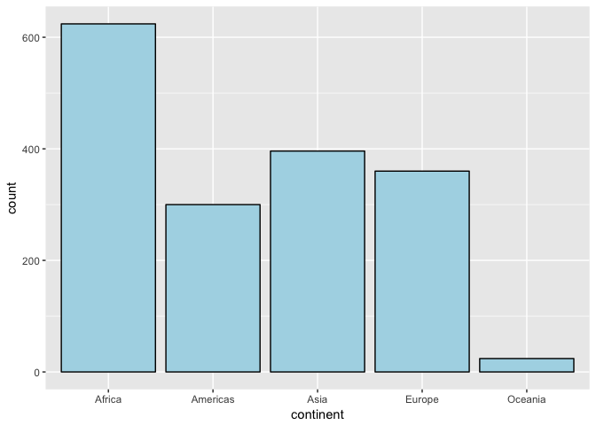
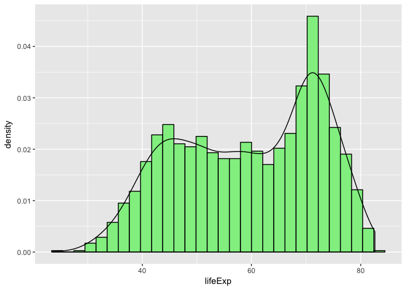
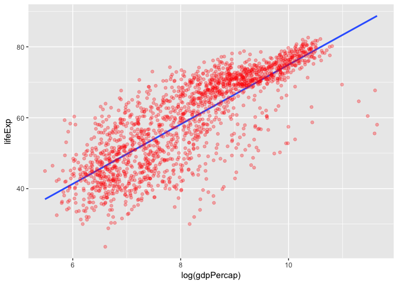
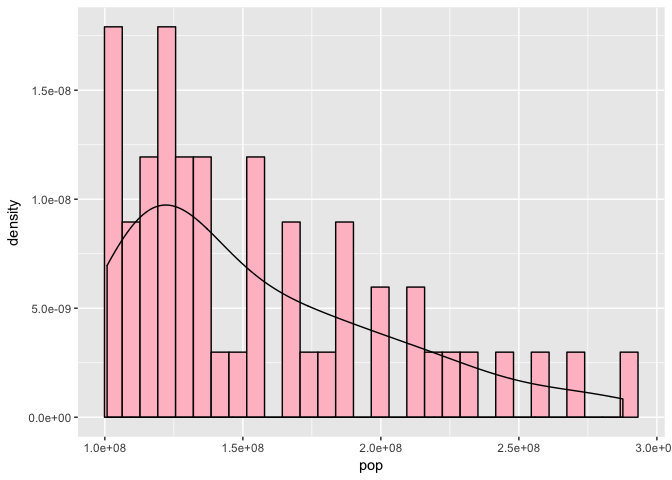
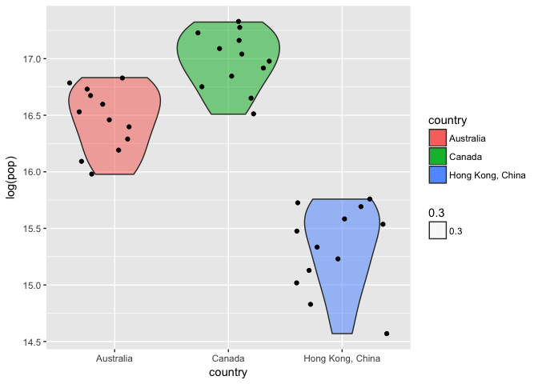
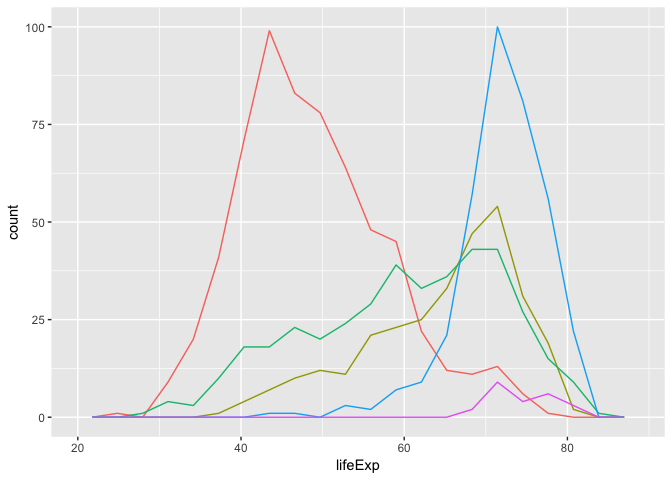

Homework 02 Exploring Gapminder
================

## Overview

This Rmarkdown file aims to explore the gapminder dataset and use it as
a cheatsheet for future data analysis and figure plotting.

## Import data frame and tidyverse pacakge

Gapminder data will be used in this homework, and the dataset will be
explored using “tidyverse” package.

``` r
library(gapminder)
library(tidyverse)
```

    ## ── Attaching packages ──────────────────────────────────────────────────────────── tidyverse 1.2.1 ──

    ## ✔ ggplot2 2.2.1     ✔ purrr   0.2.4
    ## ✔ tibble  1.4.1     ✔ dplyr   0.7.4
    ## ✔ tidyr   0.7.2     ✔ stringr 1.2.0
    ## ✔ readr   1.1.1     ✔ forcats 0.2.0

    ## ── Conflicts ─────────────────────────────────────────────────────────────── tidyverse_conflicts() ──
    ## ✖ dplyr::filter() masks stats::filter()
    ## ✖ dplyr::lag()    masks stats::lag()

## Some features of the dataset

This part explores the features of the dataset. Including the tpye of
the dataset, classes of the dataset, number of columns and rows of the
dataset, and the data type of each vairables. These features of the
dataset can be acquired by using R functions as “gapminder”, “class”,
“ncol” and “nrow” (or “dim”) , and “str” respectively. To obtain the
size of the dataset, “ncol”, “nrow”, “dim”, and “str” can be used.

``` r
print(gapminder)
```

    ## # A tibble: 1,704 x 6
    ##    country     continent  year lifeExp      pop gdpPercap
    ##    <fctr>      <fctr>    <int>   <dbl>    <int>     <dbl>
    ##  1 Afghanistan Asia       1952    28.8  8425333       779
    ##  2 Afghanistan Asia       1957    30.3  9240934       821
    ##  3 Afghanistan Asia       1962    32.0 10267083       853
    ##  4 Afghanistan Asia       1967    34.0 11537966       836
    ##  5 Afghanistan Asia       1972    36.1 13079460       740
    ##  6 Afghanistan Asia       1977    38.4 14880372       786
    ##  7 Afghanistan Asia       1982    39.9 12881816       978
    ##  8 Afghanistan Asia       1987    40.8 13867957       852
    ##  9 Afghanistan Asia       1992    41.7 16317921       649
    ## 10 Afghanistan Asia       1997    41.8 22227415       635
    ## # ... with 1,694 more rows

``` r
print(class(gapminder))
```

    ## [1] "tbl_df"     "tbl"        "data.frame"

``` r
print(ncol(gapminder))
```

    ## [1] 6

``` r
print(nrow(gapminder))
```

    ## [1] 1704

``` r
print(dim(gapminder))
```

    ## [1] 1704    6

``` r
print(str(gapminder))
```

    ## Classes 'tbl_df', 'tbl' and 'data.frame':    1704 obs. of  6 variables:
    ##  $ country  : Factor w/ 142 levels "Afghanistan",..: 1 1 1 1 1 1 1 1 1 1 ...
    ##  $ continent: Factor w/ 5 levels "Africa","Americas",..: 3 3 3 3 3 3 3 3 3 3 ...
    ##  $ year     : int  1952 1957 1962 1967 1972 1977 1982 1987 1992 1997 ...
    ##  $ lifeExp  : num  28.8 30.3 32 34 36.1 ...
    ##  $ pop      : int  8425333 9240934 10267083 11537966 13079460 14880372 12881816 13867957 16317921 22227415 ...
    ##  $ gdpPercap: num  779 821 853 836 740 ...
    ## NULL

## Explore individual variables

Explore “continent” vairable and “lifeExp” variable.

The possible values of a categorical vairable: continent can be obtained
as follows.

``` r
gapminder %>%
  select(continent) %>% 
  unique()
```

    ## # A tibble: 5 x 1
    ##   continent
    ##   <fctr>   
    ## 1 Asia     
    ## 2 Europe   
    ## 3 Africa   
    ## 4 Americas 
    ## 5 Oceania

The range of a quantitative vairable : lifeExp can be obtained as
follows.

``` r
gapminder %>% 
  select(lifeExp) %>% 
  range()
```

    ## [1] 23.599 82.603

The distribution of a categorical variable: continent can be obtained as
follows. It shows how many entries each values has in the variable. It
shows that the value “Africa” has the largest number of enties whereas
the value “Oceania” has the least.

``` r
gapminder %>% 
  ggplot(aes(continent)) +
  geom_histogram(stat="count", color = "black", fill = "lightblue")
```

    ## Warning: Ignoring unknown parameters: binwidth, bins, pad

<!-- -->

The distribution of a quantitative variable: “lifeExp” can be obtained
as follows.

``` r
gapminder %>% 
  ggplot(aes(lifeExp)) +
  geom_histogram(aes(y=..density..), color = "black", fill = "lightgreen") +
  geom_density()
```

    ## `stat_bin()` using `bins = 30`. Pick better value with `binwidth`.

<!-- -->

## Making various types of plots

Different types of plots will be made in this part.

A scatterplot of two variables as “lifeExp” and “gdpPercap”. A
regression line that fits the points was added on top of the plot and it
shows that variable gdpPercap and lifeExp is positively related.

``` r
gapminder %>%
  ggplot(aes(log(gdpPercap), lifeExp)) +
  geom_smooth(method = "lm", se=FALSE) +
  geom_point(alpha=0.3, color = "red")
```

<!-- -->

A kernel density of values that is greater than 100 million but smaller
than 300 million in variable “pop”.

``` r
gapminder %>%
  filter(pop>100000000 & pop<300000000) %>% 
  ggplot(aes(pop)) +
  geom_histogram(aes(y=..density..), color = "black", fill = "pink") +
  geom_density()
```

    ## `stat_bin()` using `bins = 30`. Pick better value with `binwidth`.

<!-- -->

A boxplot of some countries and their population.

``` r
gapminder %>%
  filter(country=="Canada" | country == "Australia" | country == "Hong Kong, China") %>% 
  ggplot(aes(country, log(pop))) +
  geom_violin(aes(fill = country, alpha = 0.3)) +
  geom_jitter()
```

<!-- -->

## More explorations\!

The code given in the assginment works well. It will get the data for
Rwanda and Afghanistan.

``` r
filter(gapminder, country == c("Rwanda", "Afghanistan"))
```

    ## # A tibble: 12 x 6
    ##    country     continent  year lifeExp      pop gdpPercap
    ##    <fctr>      <fctr>    <int>   <dbl>    <int>     <dbl>
    ##  1 Afghanistan Asia       1957    30.3  9240934       821
    ##  2 Afghanistan Asia       1967    34.0 11537966       836
    ##  3 Afghanistan Asia       1977    38.4 14880372       786
    ##  4 Afghanistan Asia       1987    40.8 13867957       852
    ##  5 Afghanistan Asia       1997    41.8 22227415       635
    ##  6 Afghanistan Asia       2007    43.8 31889923       975
    ##  7 Rwanda      Africa     1952    40.0  2534927       493
    ##  8 Rwanda      Africa     1962    43.0  3051242       597
    ##  9 Rwanda      Africa     1972    44.6  3992121       591
    ## 10 Rwanda      Africa     1982    46.2  5507565       882
    ## 11 Rwanda      Africa     1992    23.6  7290203       737
    ## 12 Rwanda      Africa     2002    43.4  7852401       786

Show numerical tables in a more attractive way.

``` r
gapminder %>% 
  select(country, lifeExp, year, gdpPercap) %>% 
  filter(country == "Canada") %>% 
  knitr::kable()
```

| country | lifeExp | year | gdpPercap |
| :------ | ------: | ---: | --------: |
| Canada  |  68.750 | 1952 |  11367.16 |
| Canada  |  69.960 | 1957 |  12489.95 |
| Canada  |  71.300 | 1962 |  13462.49 |
| Canada  |  72.130 | 1967 |  16076.59 |
| Canada  |  72.880 | 1972 |  18970.57 |
| Canada  |  74.210 | 1977 |  22090.88 |
| Canada  |  75.760 | 1982 |  22898.79 |
| Canada  |  76.860 | 1987 |  26626.52 |
| Canada  |  77.950 | 1992 |  26342.88 |
| Canada  |  78.610 | 1997 |  28954.93 |
| Canada  |  79.770 | 2002 |  33328.97 |
| Canada  |  80.653 | 2007 |  36319.24 |

Using a couple of dplyr functions on a single table.

``` r
gapminder %>% 
  select(- gdpPercap) %>% 
  filter(country %in% c("China", "Canada"), year %in% c(2002, 2007)) %>% 
  arrange(desc(pop))
```

    ## # A tibble: 4 x 5
    ##   country continent  year lifeExp        pop
    ##   <fctr>  <fctr>    <int>   <dbl>      <int>
    ## 1 China   Asia       2007    73.0 1318683096
    ## 2 China   Asia       2002    72.0 1280400000
    ## 3 Canada  Americas   2007    80.7   33390141
    ## 4 Canada  Americas   2002    79.8   31902268

## Adapting some exercise from R for Data Science to the gapminder data set

Q: Run ggplot(data = gapminder). What do you see?

A: A blank plot.

``` r
ggplot(gapminder)
```

<!-- -->

Q: What does show.legend = FALSE do? What happens if you remove it?

A: It removes the legend. An example is given as follows.

Use geom\_freqpoly() to overlay several histograms in the same plot.

``` r
gapminder %>% 
  ggplot(aes(lifeExp, colour = continent)) +
  geom_freqpoly(bins = 20, show.legend = FALSE)
```

<!-- -->
